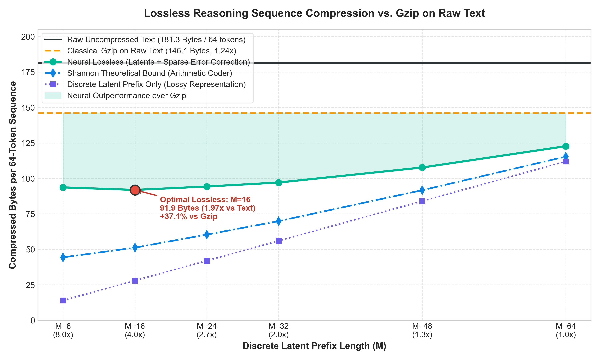
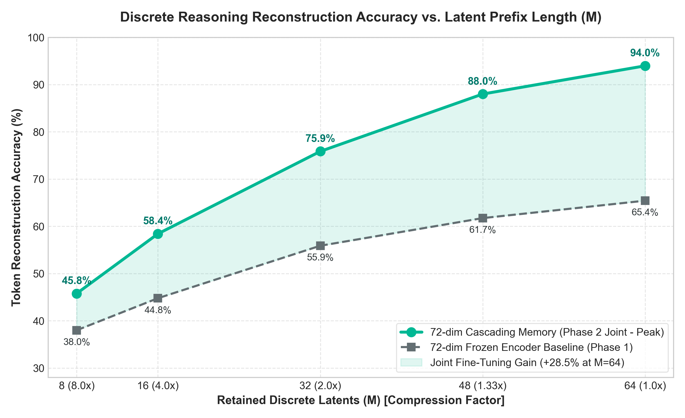
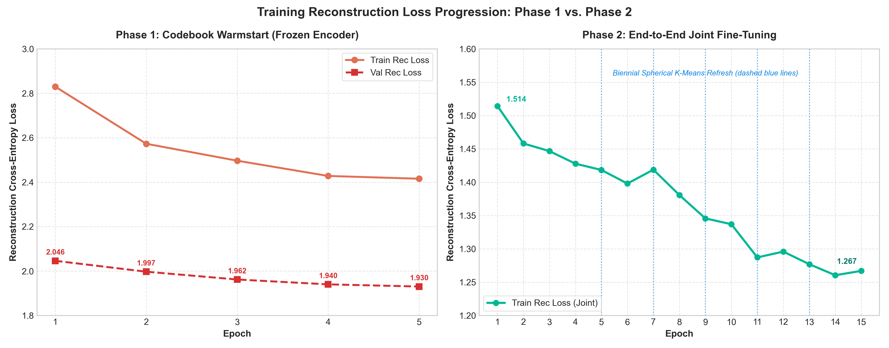

# Math-Reasoning-Discrete-Autoencoder

LLMs are very verbose and datasets for fine-tuning LLMs for math can take up to terabytes of storage. With this lightweight discrete autoencoder for text, it enables lossless compression better than the standard gzip by 37% (and up to 2x compression vs. raw text).

---

## Performance

### 1. Lossless Compression vs. Gzip on Raw Text
In mathematical reasoning corpora, raw UTF-8 text for 64-token chunks averages **181.3 Bytes**. Standard Gzip (level 9) compresses this to **146.1 Bytes (1.24x compression)** due to dictionary overhead on short text snippets.

Our discrete autoencoder combined with sparse error correction achieves **91.9 Bytes (1.97x compression vs. raw text)** at $M=16$—beating Gzip by **37.1%**—and outperforms Gzip across every latent prefix budget from $M=8$ to $M=64$.



#### Lossless Benchmark Comparison (Raw Text = 181.3 Bytes Avg / 64 Tokens):
| Latent Prefix ($M$) | Latents Only | Neural Lossless Total | Gzip on Raw Text | Savings vs. Gzip | Compression vs. Text | Shannon Theoretical Bound |
| :---: | :---: | :---: | :---: | :---: | :---: | :---: |
| **$M = 8$ (8.0x)** | **14.0 B** (12.95x) | 93.7 B | 146.1 B (1.24x) | **+35.9% smaller** | **1.94x** | 44.4 B (4.08x) |
| **$M = 16$ (4.0x)** | **28.0 B** (6.48x) | **91.9 B** | 146.1 B (1.24x) | **+37.1% smaller** | **1.97x** | 51.2 B (3.54x) |
| **$M = 24$ (2.7x)** | **42.0 B** (4.32x) | 94.3 B | 146.1 B (1.24x) | **+35.5% smaller** | **1.92x** | 60.4 B (3.00x) |
| **$M = 32$ (2.0x)** | **56.0 B** (3.24x) | 97.1 B | 146.1 B (1.24x) | **+33.5% smaller** | **1.87x** | 69.9 B (2.59x) |
| **$M = 48$ (1.3x)** | **84.0 B** (2.16x) | 104.9 B | 146.1 B (1.24x) | **+28.2% smaller** | **1.73x** | 87.5 B (2.07x) |
| **$M = 64$ (1.0x)** | **112.0 B** (1.62x) | 115.1 B | 146.1 B (1.24x) | **+21.2% smaller** | **1.58x** | 106.3 B (1.71x) |

---

### 2. Discrete Reconstruction Accuracy vs. Latent Prefix Length ($M$)
Comparison between the **72-dim Phase 2 Joint End-to-End Model** and the **Phase 1 Frozen Encoder Baseline**:



- **End-to-End Co-adaptation**: Jointly fine-tuning the encoder alongside the discrete codebook yields a **+28.5% accuracy gain** at full capacity ($M=64$: **93.98%** vs. 65.43%).
- **High Compression Retention**: At 2x compression ($M=32$), exact token accuracy is **75.87%**; at 4x compression ($M=16$), accuracy remains at **58.42%**.
- **Codebook Utilization**: Active utilization reaches **16,248 / 16,384 discrete codes (99.2% capacity)**, completely preventing codebook collapse.

---

### 3. Reconstruction Loss Training Dynamics
Training progression comparing Phase 1 (frozen encoder codebook warmstart) and Phase 2 (end-to-end joint fine-tuning):



- **Phase 1 (Warmstart, 5 Epochs)**: Spherical K-Means centroid clustering initializes the unit-sphere discrete codebook, dropping validation loss to 1.930 while keeping encoder weights frozen.
- **Phase 2 (Joint Fine-tuning, 15 Epochs)**: Unfreezes the full transformer encoder with differential learning rates, scheduled word dropout ($0.28 \to 0.05$), and biennial Spherical K-Means refresh (epochs 5, 7, 9, 11, 13, marked with vertical dashed lines), dropping cross-entropy loss to 1.260.

---

## How It Works

1. **Tokenization**: Raw mathematical text is tokenized into 64-token chunks using the RoBERTa-base Byte-Pair Encoding (BPE) tokenizer.
2. **Cascading Memory Encoder**: A 3-layer Transformer encoder ($d_{\text{model}} = 72$, 4 attention heads) maps the text into sequence representations.
3. **Discrete Vector Quantization (VQ)**: A cascading memory module quantizes the representation into 64 discrete latent tokens selected from a 16,384-entry unit-sphere codebook ($\log_2(16384) = 14$ bits per code).
4. **Variable Prefix Selection ($M \in [8..64]$)**: An indexer picks the first $M$ discrete latent tokens to form a compact latent prefix, enabling dynamic, user-tunable compression ratios from $1.0\times$ down to $8.0\times$.
5. **Autoregressive Decoder**: A 3-layer causal Transformer decoder reconstructs the original 64-token sequence conditioned on the $M$ discrete prefix tokens.
6. **Lossless Storage via Residuals**:
   - **Neural Lossless Bitstream**: Stores the $M$ discrete 14-bit indices alongside a sparse bitmask and token IDs of any mispredicted tokens.
   - **Arithmetic Coding**: For maximal compression, the decoder's predictive logits serve as the probability distribution for an arithmetic coder, approaching the theoretical Shannon entropy bound (up to 4.08x compression vs. raw text).

---

## Repository Structure

```
├── benchmarks/
│   ├── accuracy_vs_prefix_length.png        # Peak vs. baseline accuracy curve
│   ├── reconstruction_loss_training_curves.png # Phase 1 & Phase 2 loss curves
│   ├── lossless_compression_vs_gzip.png     # Lossless benchmark vs Gzip on raw text
│   ├── compute_lossless_stats.py            # Standalone lossless benchmark script
│   └── generate_charts.py                   # Chart generation script
├── data/
│   ├── dataset.py                           # Dynamic chunking & tokenization dataset
│   └── tokenized_fast_tensor_64.pt          # Fast evaluation tensor cache
├── models/
│   └── checkpoints_discrete_joint_gpu/
│       ├── joint_discrete_epoch_15.pt       # Best 72-dim discrete model checkpoint
│       └── model_config.json                # Model hyperparameters
├── training/
│   ├── train_cascading_memory.py            # Continuous pretraining script
│   ├── train_discrete_codebook_frozen_encoder.py # Phase 1 frozen codebook training
│   └── train_discrete_joint_finetune.py     # Phase 2 joint fine-tuning script
├── cascading_memory_model.py                # Core architecture & VQ implementation
├── compress.py                              # CLI tool for compression & reconstruction
├── visualize.py                             # Interactive browser visualizer
├── requirements.txt                         # Python dependencies
└── README.md
```

---

## Installation

Clone the repository and install the dependencies:

```bash
git clone https://github.com/asdfaqer/Math-Reasoning-Discrete-Autoencoder.git
cd Math-Reasoning-Discrete-Autoencoder
pip install -r requirements.txt
```

---

## Quickstart & Usage

### 1. Compression CLI (`compress.py`)
Compress any mathematical reasoning text into discrete latent indices and reconstruct it:

```bash
python compress.py --prefix_len 16 --text "Let x be a real number such that x^2 + 5x + 6 = 0. Solving the quadratic equation gives x = -2 or x = -3."
```

### 2. Interactive Web Visualizer (`visualize.py`)
Launch the real-time browser interface to inspect latent tokens, codebook activations, and reconstruction probabilities:

```bash
python visualize.py --checkpoint models/checkpoints_discrete_joint_gpu/joint_discrete_epoch_15.pt --port 8080
```

### 3. Reproduce Benchmarks
Re-run the lossless compression benchmarks and generate the charts:

```bash
python benchmarks/compute_lossless_stats.py
python benchmarks/generate_charts.py
```
